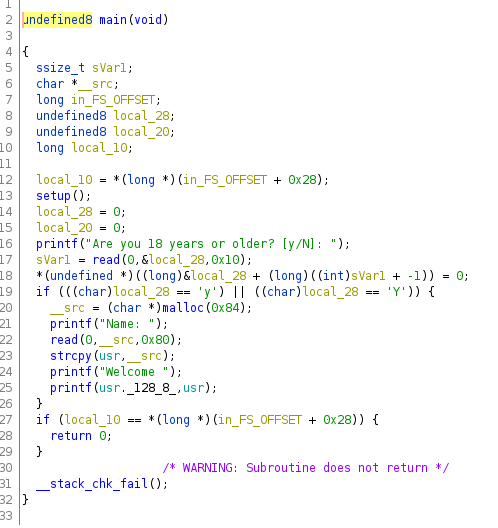
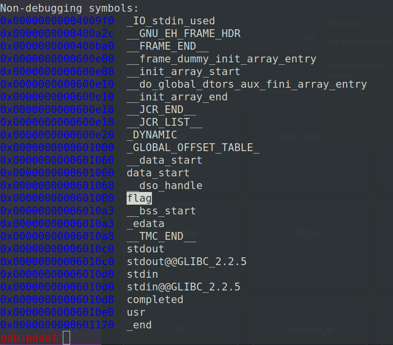
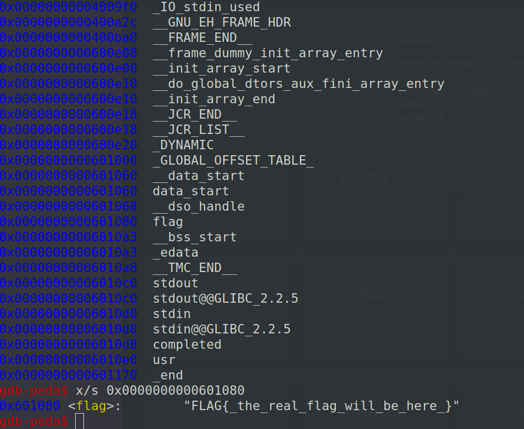
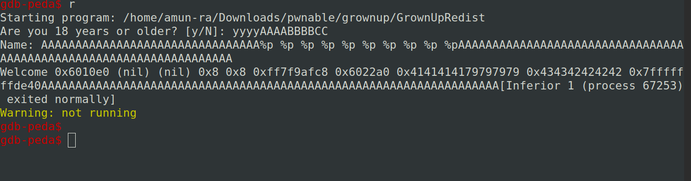

This binary is a not-stripped binary

So we can read symbols from it

Lets use Ghidra to decompile the binary

-----



Lets assume,

local_28 ---> condition (0x10 bytes = 16 bytes)

usr ---> usr (0x80 bytes = 128 bytes)

-----

This program checks the condition of,

If condition = 'y' | 'Y'

If true,asks name and prints it with welcome message

If flase,breaks

-----

Way to exploit this binary is by using format string vulnerability

Beacuse it uses printf() function to print values

Using printf() statements we can print the values from the stack using {%p %lp %x %s}

-----

Since its a non-stripped binary,

We can analyze symbols in it

Analyzing function we get nothing interesting from that

Analyzing variable we get a flag variable used to store flag in it



As we can see here it is in the program memory



While checking the string format,

It seems to have the flag with the same format

But this ELF is a local file used for debugging

So its not the original flag

The original flag will be in the host

--

We can also use this command

```
strings GrownUpRedist
```

to check the flag value from the binary, unfortunately its not available

If possible this challenge would have finished in a minute (That's what every one will do)

-----

So how do we get the flag?

We know the flag variables address..

How do we get it using format string vulnerability

Lets try passing format string data to "usr" variable,

Inputs like (A*32)+%p %p %p ....... 

(We pass A's before %p, to write data into the variable so that it can result the stack addresses from %p..Will explain later)

It outputs the random value from stack,but we don't know from which address its coming from

-----

So lets pass more values in "condition variable"

input on condition : yyyyAAAABBBBCC

We can pass values upto 16 bytes (upto size of condition)

And we should pass the input data of the 128 bytes to "usr"



'A'*32+"%p "*10+'A'*(128-32-30)

When we pass this input

We get values from stack being printed as output

Our given input yyyyAAAABBBBCC is stored in hex 8 bytes in little endian order in 8th and 9th place

Junk of 32 A's are passed before so that it gets copied into "usr" along with remaining data, and the remaining data will be printed using printf() triggering format string vulnerability

How i got 32? to trigger format string vulnerability i passed junk of 'A's in the multiple of 8

I got good results after 32 A's

So you can pass junk values exceeding the length of 32 A's

In the printed stack values,

Our input of 16 bytes can be splitted into 8 bytes

So in the input of "condition",we can pass random junk of 'y's or 'Y's to make the condition true (first value should make the condition true)

Second 8 bytes of the "condition" can be passed as the little endian of the flag address

Why little endian?

As you can see the stack values are printed in little endian

So the given input flag address value can be found at the 9th place of the stack value printed using printf()

-----

using pwn tools

convert flag address into little endian

p64(flag_address)

condition input : yyyyYYYY+p64(flag_address)

should be in the length of 16 bytes so that we can get the flag_address in complete 8bytes , which can be easily called

-----

How to print flag ?

we loaded the flag address in stack

we know the flag address location in stack

to print the flag, we can use %s to print it as string from stack

so modify the 9th index from format string input to print the value

pass the data in the host correctly

GET THE FLAG