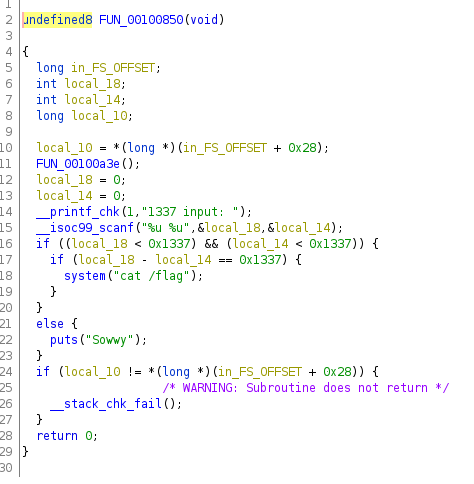

Download and extract the binary from the file

This binary is a Stripped Binary

So,Lets use Ghidra to decompile the binary to generate source code

-----

Lets assume,

local_18--->x

local_14--->y

-----

The program gets two input variable and stores it in x & y

Conditions to get flag (cat /flag)

x < 0x1337

y < 0x1337

x-y = 0x1337

-----

Implementing a python program to find x and y

x = 4918

y = -1

-----

Pass the inputs

Get the flag