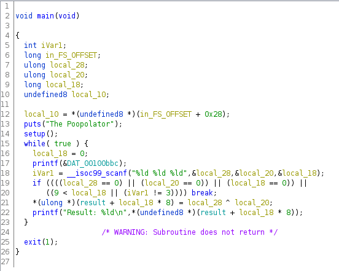
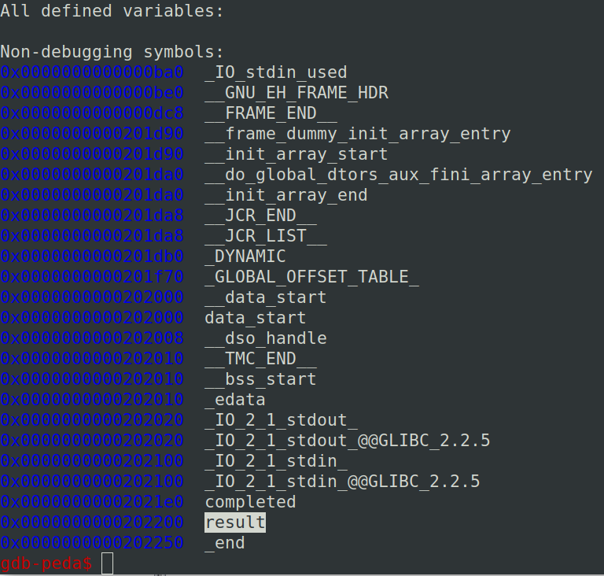
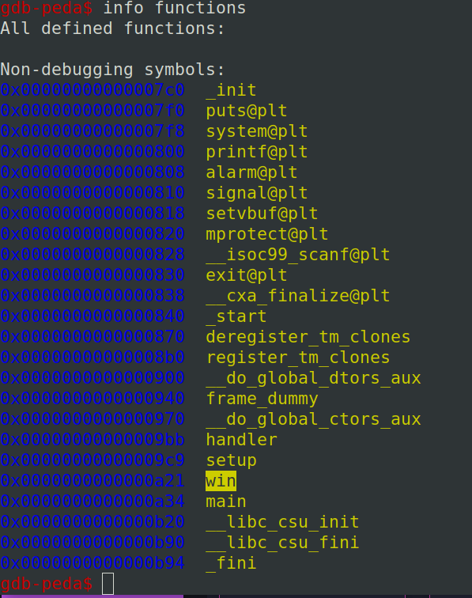
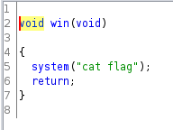
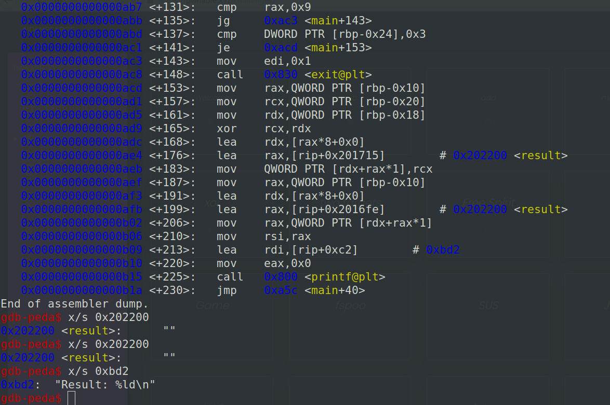
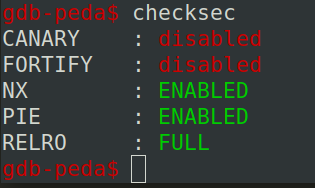
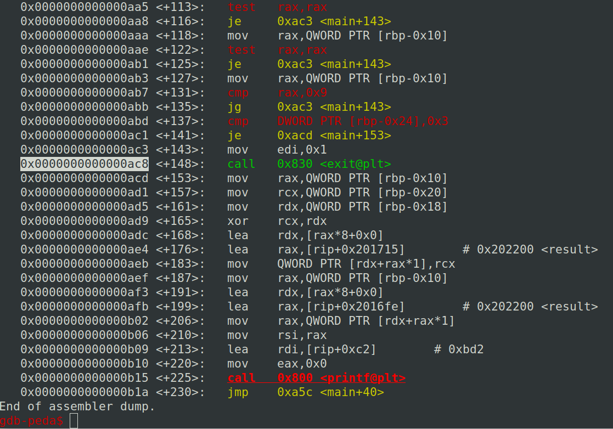
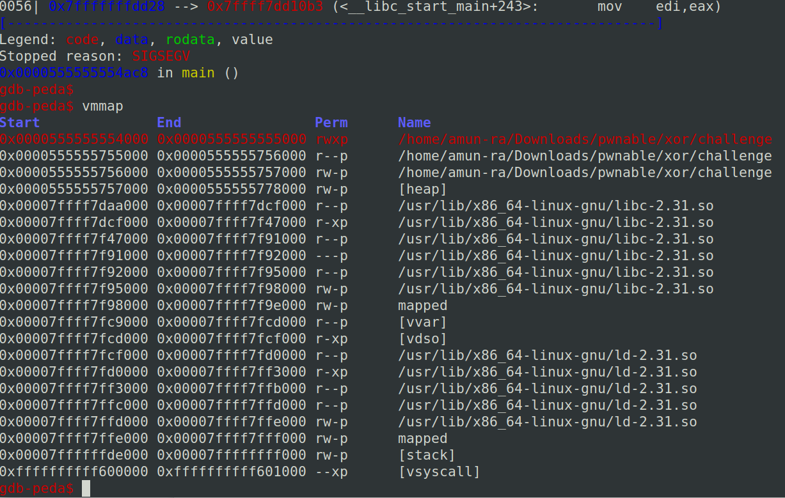

Given binary is a not-stripped binary

So we can easily read symbols from gdb-peda

Lets us Ghidra to decompile the source code for better understanding

-----



Lets assume,

local_28 ---> x

local_20 ---> y

local_18 ---> z

These three variable are input variables which gets decimal inputs

-----

The program check the condition and execute the statement in it

If true xor id done and stored in the index of an array

If false breaks

-----

Here x and y are xor-ed and stored in the z'th index of the array "result"

-----

So where does this result came from ?

It's not even declared in the main()...

Analyzing the variables you can find result



So it is a global variable

-----

Lets analyze what functions are available



So we can see win() function above main()

So win() function is @ 0xa21

main() is @ 0xa34



If we execute win(), we get the flag

-----

Lets see the main() in asm



So we can see how the inputs and outputs are being printed

------




As you can see here, this ELF has 

NX Bit Enabled - So we can't execute shellcode in stack

RELRO = FULL - Write permission is restricted

RELRO - Relocation Read-Only

-----

Here result is an int64 array which is allocated dynamically and its each index has a size of 8 bytes

Here you can see the exit() function which is being called while exiting the loop

So lets use this to call our win() function

How do we do that?

We know that

result[z]=x^y

So if we use the dynamic array "result" to point the address of 'call exit()'

We can overwrite the instruction with 'call win()'

For that,

x^y = z = address of 'call exit()'

-----



The exit() function is @ 0xac8

Now the dynamic array 'result' starts from 0x202200

To point the index to 'call exit()',we need to calculate the difference between these two address

distance = exit()_addr - result_addr

distance = 0xac8-0x202200

But for this array each index has 8 bytes,so

distance = (0xac8-0x202200)/8

Now,

result[distance] will point instruction[call exit()]

To overwrite 'call exit()' with 'call win()',

We need to pass x^y values correctly , so that this xor result will overwrite the 'call exit()' instruction

-----

How did we come to know that we can overwrite 'call exit()'? (VALID QUESTION)

In this case we need to see that we have the permission to write in the memory or not



Run the program and cause some interrupt

Run vmmap in gdb-peda

OR

In terminal,

```
$./challenge &
[Gives a PID]
$cat /proc/[PID]/maps
```

We can see that we have rwxp on the first line, which is in the memory range of 4000-5000

Clearly our main program lies within this range

So we can conclude that we have write permission over this area and we can overwrite any instructions

-----

We know win() function is at 0xa21

To get the exact value of the instrcution in hex,int data

Lets use pwn tools

```

e=ELF('./challenge')

e=asm('0xac8','call 0xa21') #inst to call win()

value=e.read('0xac8',5) #getting value for inst

value=int(value[::-1].encode('hex'),16) #little endian - base 10 - int value

```

-----

We know ,

xor of same values are 0

xor(a,a)=0

xor(a+1,1)=a

So to pass the value for inputs to overwrite the instruction

Send value+1,1,distance

Again,send any random character to break the while loop

GET THE FLAG


